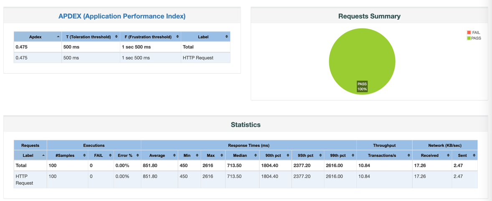

About
=====

The simplest Web Application to Post Message to file
and to store the history of already posted messages

Requirement 
============

* `JDK 1.8 or later` 
* for example `export JAVA_HOME=/Library/Java/JavaVirtualMachines/jdk-11.0.8.jdk/Contents/Home`
* `Gradle 4`
* `IDE IntelliJ community edition or professional edition`

Run
===

`./gradlew bootRun` or from IDE's run command (Grandle task)

Checks
=====
Post message
* `http://localhost:8080`

View history
* `http://localhost:8080/history`

Health check  
* `http://localhost:8080/actuator/health`

HowTo 
=====
Create Table for logger
* `create table SptringBootTable(timeStamp DATE, line VARCHAR(50));`

Performance Testing
===================

Run JMeter
`jmeter -n -t <project_name>.jmx -l jmeter.jtl`

Generate report
`jmeter -g jmeter.jtl -o report_dir`

Example of the report

